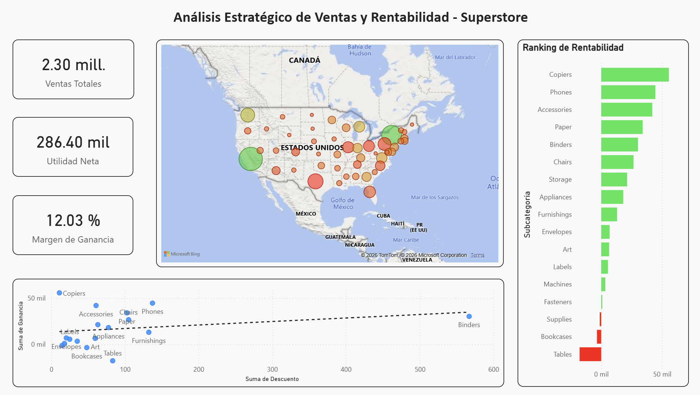

# 📊 Análisis de Rentabilidad y Optimización de Ventas (Sample Superstore)

 

## 🎯 Objetivo del Proyecto
Este proyecto tiene como fin auditar el rendimiento financiero de una cadena de retail ("Superstore") para identificar por qué ciertas categorías presentan pérdidas económicas a pesar de tener un alto volumen de ventas. El análisis se centra en la relación entre **Descuentos**, **Ventas** y **Utilidad Neta**.

## 🛠️ Stack Tecnológico
* **Python (Pandas):** Utilizado para el proceso de ETL (Extracción, Transformación y Carga), traducción de campos al español y creación de métricas calculadas como el *Margen de Ganancia*.
* **Power BI:** Diseño de un dashboard interactivo para la exploración de datos, análisis geoespacial y detección de causas raíz.

## 📁 Estructura del Repositorio
* **`01-Data/`**: Contiene el dataset `Superstore_Limpio.csv` procesado en Python.
* **`02-Python-Scripts/`**: Notebooks/Scripts con el código de limpieza y normalización.
* **`03-PowerBI-Dashboards/`**: Archivo `.pbix` con el informe visual dinámico.
* **`04-Insights-Reports/`**: Capturas del dashboard y documentación de hallazgos.

## 💡 Hallazgos Críticos (Insights)
1.  **Categorías en Pérdida:** Se identificó que las subcategorías **Tables** (-$32k) y **Bookcases** (-$38k) son los mayores puntos de fuga de capital debido a márgenes negativos constantes.
2.  **Impacto del Descuento:** El análisis de dispersión reveló que descuentos superiores al **20%** en la categoría *Binders* eliminan por completo el margen de ganancia, transformando ventas masivas en pérdidas netas.
3.  **Análisis Geográfico:** Texas y Ohio presentan los rendimientos más bajos del país. Se recomienda una revisión de la logística o de la política de precios en la región Centro-Sur.
4.  **Estrella de Rentabilidad:** La categoría **Copiers** (Fotocopiadoras) mantiene el margen más saludable, sugiriendo que el negocio debería priorizar campañas de marketing para este sector de alto valor.

## 🚀 Cómo usar este repositorio
1.  Revisar el script en `02-Python-Scripts` para entender la lógica de limpieza y transformación de los datos.
2.  Abrir el archivo `.pbix` en **Power BI Desktop** para interactuar con los filtros de región, segmento y categoría.

---
Generado como parte de mi portafolio de Análisis de Datos.
